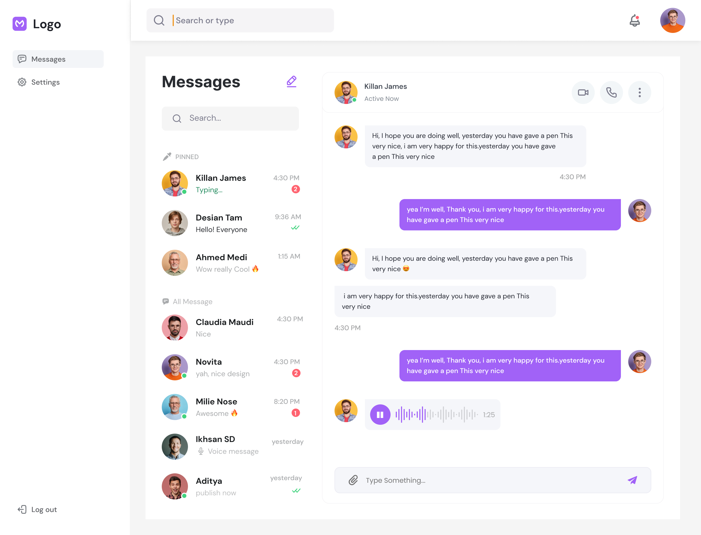

### Веб-мессенджер

Приложение для обмена мгновенными сообщениями в браузере



### Ссылка на макеты

https://www.figma.com/file/YdAQG2mcGJaTtsuAXTMoo9/Anna-Chernova?node-id=0%3A1


### Полезные команды
- `npm install` — установка зависимостей,
- `npm run dev` — запуск версии для разработчика,
- `npm run start` — команда для запуска проекта на 3000 порту,
- `npm run build` — сборка проекта.

```sh
npm install
```

```sh
npm run dev
```

```sh
npm run start
```

```sh
npm run build
```

### Ссылка на Netlify

https://gentle-axolotl-171506.netlify.app

### Используемые технологии

#### Server

- Node JS
- Express

#### Client

- JavaScript

#### Tools

- Parcel
- Sass
- Handlebars
